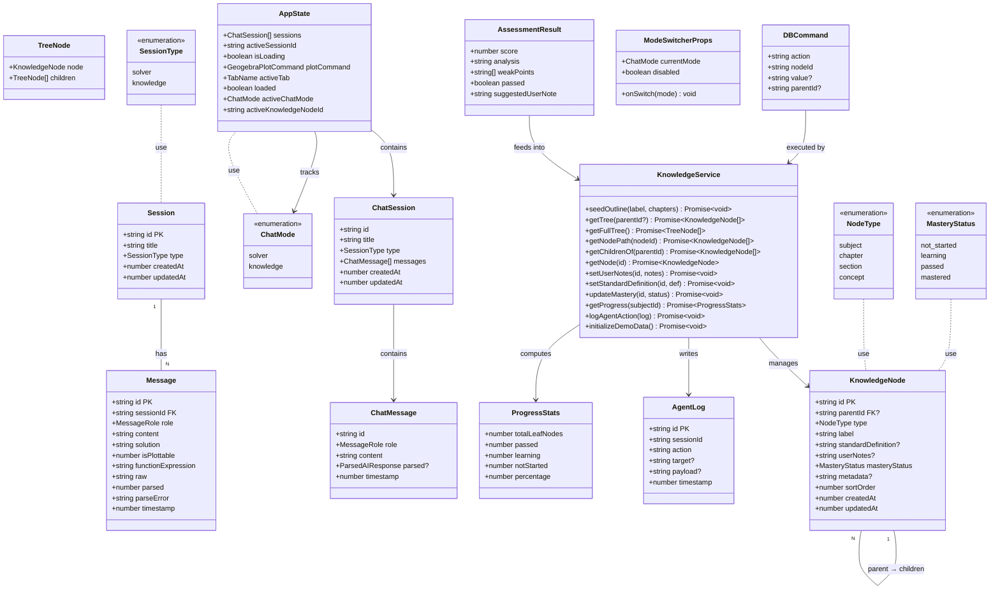
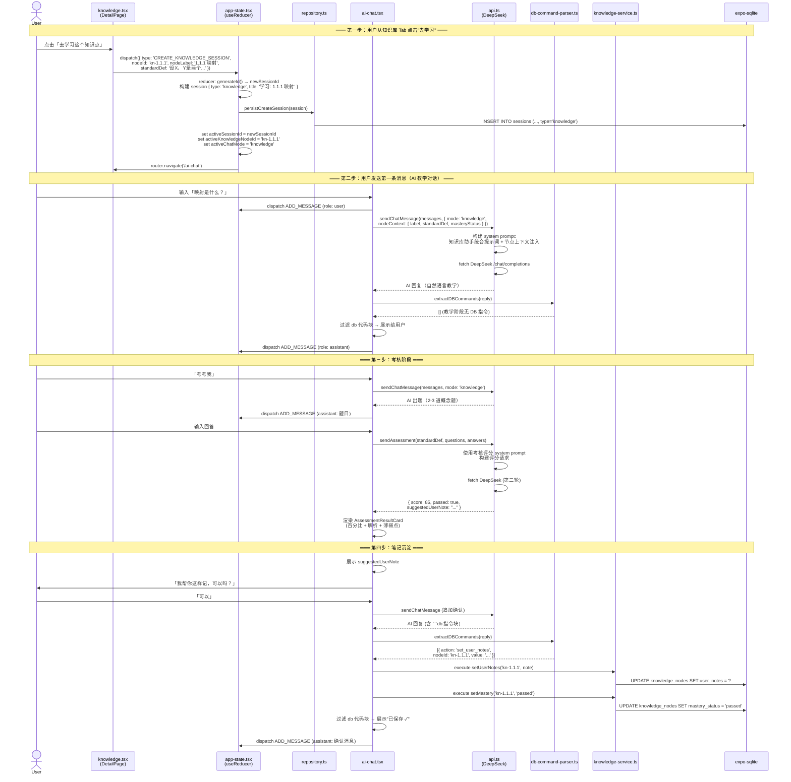
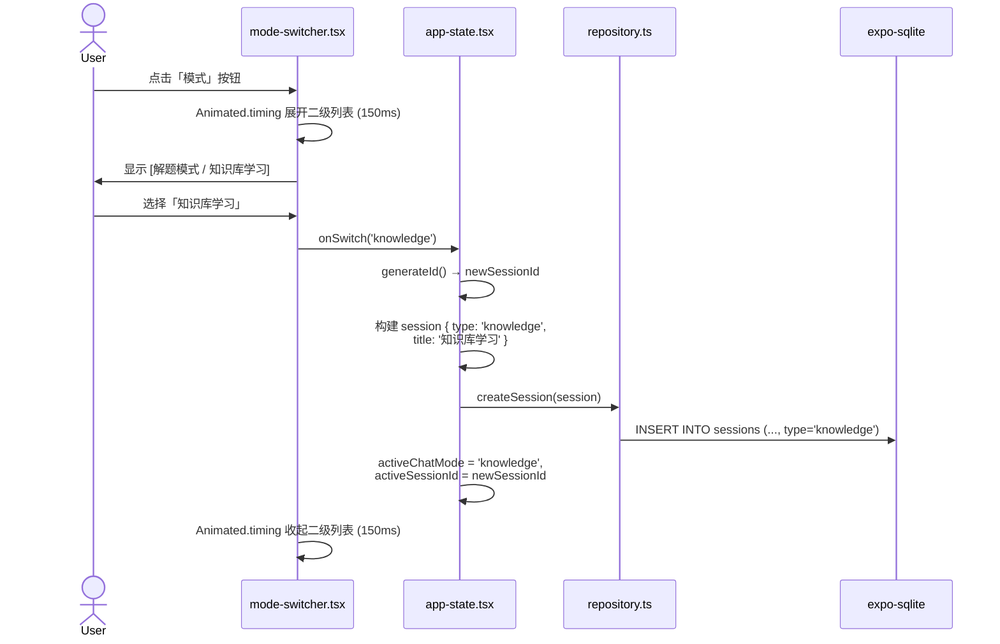
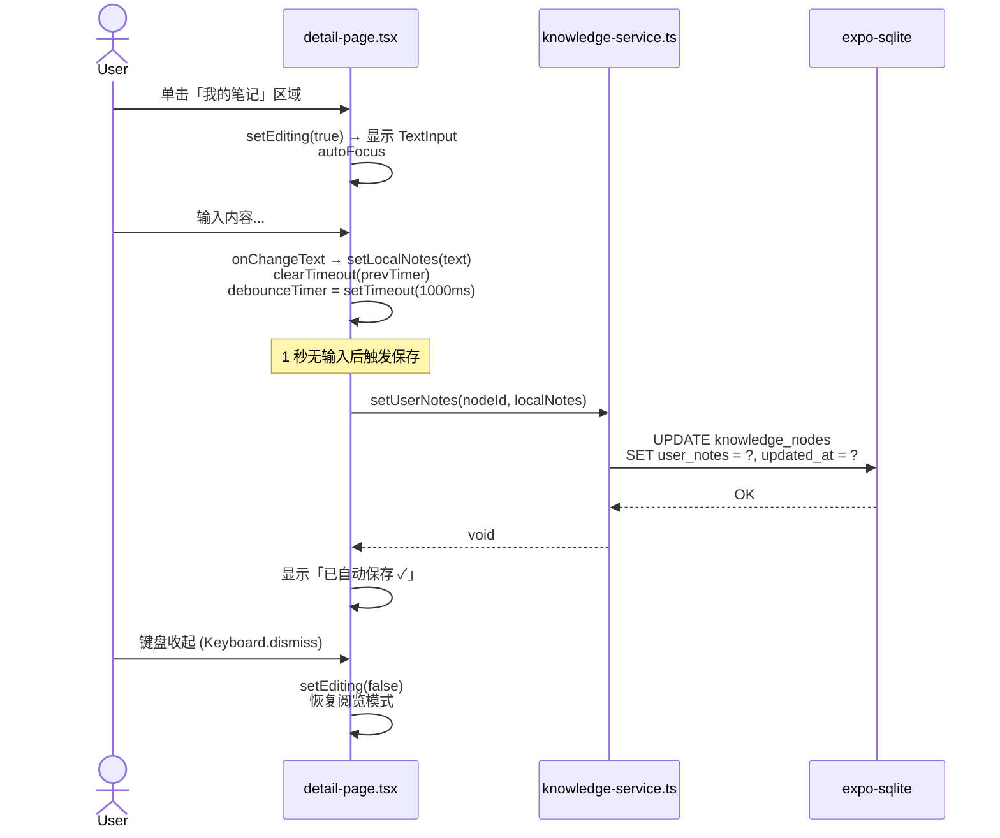
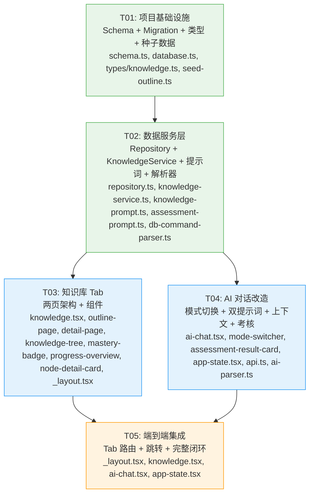

# 系统设计：LearnTools 知识库系统

> **版本**: 2.0 | **日期**: 2026-06-21 | **架构师**: 高见远 (Bob)
>
> 基于方案 v1.4，面向 Demo 第一阶段（第一章前 5 个知识点 1.1.1~1.1.5）

---

## Part A: 系统设计

### 1. 实现方案

#### 1.1 整体架构

```
┌─────────────────────────────────────────────────────┐
│                    UI Layer (React Native)            │
│  app/_layout.tsx  ─  expo-router Tab 导航             │
│  ┌──────────┐  ┌──────────────┐  ┌──────────────┐   │
│  │ GeoGebra │  │   AI对话      │  │   知识库      │   │
│  │ (不变)   │  │ (扩展模式)    │  │ (两页架构)    │   │
│  └──────────┘  └──────┬───────┘  └──────┬───────┘   │
│                       │                  │            │
├───────────────────────┼──────────────────┼────────────┤
│              State Layer (React Context + useReducer)  │
│  app-state.tsx  ─  AppState (sessions, activeTab..)   │
│  ★ 扩展: activeChatMode, activeKnowledgeNode          │
├───────────────────────┼──────────────────┼────────────┤
│               Service Layer                           │
│  ┌──────────┐  ┌──────────────┐  ┌──────────────┐   │
│  │ api.ts   │  │ knowledge-   │  │ db-command-   │   │
│  │ (多模式) │  │ service.ts   │  │ parser.ts     │   │
│  └────┬─────┘  └──────┬───────┘  └──────┬───────┘   │
│       │               │                  │            │
├───────┼───────────────┼──────────────────┼────────────┤
│               Data Layer (expo-sqlite + Drizzle ORM)   │
│  schema.ts / database.ts / repository.ts / migrate.ts │
│  ┌──────────┐  ┌──────────────┐  ┌──────────────┐   │
│  │sessions  │  │knowledge_    │  │  agent_logs  │   │
│  │(+type)   │  │nodes         │  │              │   │
│  └──────────┘  └──────────────┘  └──────────────┘   │
└─────────────────────────────────────────────────────┘
```

#### 1.2 核心技术难点与方案

| 难点 | 选型 | 理由 |
|------|------|------|
| 知识树渲染 | React Native `SectionList` 嵌套 + 递归 `FlatList` | 原生性能，无需第三方树组件；`SectionList` 天然支持折叠/展开 |
| 模式切换 | 自研 `Animated` 展开/收起二级列表 | 轻量，避免引入 action sheet 库；与现有按钮行风格一致 |
| 双页滑动导航 | `Animated.View` + `PanResponder`（手机端）/ `flexDirection: 'row'`（宽屏） | RN 原生手势能力，不引入 react-navigation 嵌套 |
| 笔记防抖保存 | `useRef` + `setTimeout` + `clearTimeout` | 标准防抖模式，无需引入 lodash |
| DB 指令解析 | 自研正则提取 ` ```db ` 代码块 | 极简实现，覆盖方案中 4 种操作 |
| 数据库迁移 | 直接在 `database.ts` 新增 `ALTER TABLE` + `CREATE TABLE IF NOT EXISTS` | 避免引入 Drizzle Kit migration runner；与现有 `createTablesIfNeeded` 模式一致 |

#### 1.3 技术栈

| 层 | 技术 | 版本 |
|----|------|------|
| 框架 | React Native (Expo) | SDK 56 |
| 路由 | expo-router | built-in |
| 数据库 | expo-sqlite | built-in (SDK 56) |
| ORM | Drizzle ORM (仅类型定义) | 现有版本 |
| AI | DeepSeek Chat API | v1 |
| 样式 | NativeWind (Tailwind CSS for RN) | 现有版本 |
| 图标 | react-native-svg | 现有版本 |
| 存储 | @react-native-async-storage/async-storage | 现有版本（仅用于迁移） |

### 2. 文件列表

```
src/
├── db/
│   ├── schema.ts                    # [修改] sessions 加 type；新增 knowledgeNodes + agentLogs
│   ├── database.ts                  # [修改] createTablesIfNeeded 新增新表 + migration
│   ├── repository.ts                # [修改] createSession 增加 type 参数
│   ├── knowledge-service.ts         # [新增] KnowledgeService 类（树查询/CRUD/进度/笔记）
│   ├── seed-outline.ts              # [新增] 第一章前 5 节点种子数据 + 初始化函数
│   ├── migrate.ts                   # [不变] 存量数据迁移
│   └── logger.ts                    # [不变] 数据库日志
│
├── lib/
│   ├── app-state.tsx                # [修改] AppState/ChatSession 扩展 type + mode + 节点上下文
│   ├── api.ts                       # [修改] 双系统提示词支持 + 考核评分 API 调用
│   ├── ai-parser.ts                 # [修改] 扩展到知识库模式解析
│   ├── knowledge-prompt.ts          # [新增] 知识库助手统合系统提示词
│   ├── assessment-prompt.ts         # [新增] 考核评分 prompt 构建
│   └── db-command-parser.ts         # [新增] AI 回复中 ```db 指令块解析与执行
│
├── app/
│   ├── _layout.tsx                  # [修改] more → knowledge Tab 名称 + 图标
│   ├── ai-chat.tsx                  # [修改] 模式切换按钮 + 双系统提示词 + 节点上下文
│   └── knowledge.tsx                # [改造] 原 more.tsx → 两页架构大纲界面
│
├── components/
│   ├── knowledge/
│   │   ├── outline-page.tsx         # [新增] 大纲页（知识树 + 进度概览）
│   │   ├── detail-page.tsx          # [新增] 节点详情页（标准定义 + 可编辑笔记 + 去学习按钮）
│   │   ├── knowledge-tree.tsx       # [新增] 递归 SectionList 知识树组件
│   │   ├── node-detail-card.tsx     # [新增] 节点详情卡片
│   │   ├── mastery-badge.tsx        # [新增] 掌握状态徽章组件
│   │   └── progress-overview.tsx    # [新增] 进度概览条
│   │
│   └── chat/
│       ├── mode-switcher.tsx        # [新增] 模式切换按钮 + Animated 展开二级列表
│       └── assessment-result-card.tsx # [新增] 考核结果卡片（百分比 + 解析 + 建议笔记）
│
└── types/
    └── knowledge.ts                 # [新增] 知识库相关类型定义
```

**总计**: 新增 14 个文件，修改 6 个文件，不变 3 个文件。

### 3. 数据结构和接口

#### 3.1 类图 (Drizzle Schema + TypeScript 类型)



#### 3.2 核心表 DDL

```sql
-- sessions 表扩展
ALTER TABLE sessions ADD COLUMN type TEXT DEFAULT 'solver' NOT NULL;

-- knowledge_nodes 表
CREATE TABLE IF NOT EXISTS knowledge_nodes (
  id                  TEXT PRIMARY KEY NOT NULL,
  parent_id           TEXT,
  type                TEXT NOT NULL,
  label               TEXT NOT NULL,
  standard_definition TEXT,
  user_notes          TEXT,
  mastery_status      TEXT NOT NULL DEFAULT 'not_started',
  metadata            TEXT,
  sort_order          INTEGER NOT NULL DEFAULT 0,
  created_at          INTEGER NOT NULL,
  updated_at          INTEGER NOT NULL,
  FOREIGN KEY (parent_id) REFERENCES knowledge_nodes(id) ON DELETE CASCADE
);

CREATE INDEX IF NOT EXISTS idx_nodes_parent ON knowledge_nodes(parent_id);
CREATE INDEX IF NOT EXISTS idx_nodes_type ON knowledge_nodes(type);
CREATE INDEX IF NOT EXISTS idx_nodes_label ON knowledge_nodes(label);

-- agent_logs 表
CREATE TABLE IF NOT EXISTS agent_logs (
  id         TEXT PRIMARY KEY NOT NULL,
  session_id TEXT NOT NULL,
  action     TEXT NOT NULL,
  target     TEXT,
  payload    TEXT,
  timestamp  INTEGER NOT NULL
);

CREATE INDEX IF NOT EXISTS idx_logs_session ON agent_logs(session_id);
```

#### 3.3 TypeScript 类型定义 (`types/knowledge.ts`)

```typescript
// ── 节点类型 ──
export type NodeType = 'subject' | 'chapter' | 'section' | 'concept';
export type MasteryStatus = 'not_started' | 'learning' | 'passed' | 'mastered';

export interface KnowledgeNode {
  id: string;
  parentId: string | null;
  type: NodeType;
  label: string;
  standardDefinition: string | null;
  userNotes: string | null;
  masteryStatus: MasteryStatus;
  metadata: Record<string, unknown> | null;
  sortOrder: number;
  createdAt: number;
  updatedAt: number;
}

export interface TreeNode {
  node: KnowledgeNode;
  children: TreeNode[];
}

// ── 进度统计 ──
export interface ProgressStats {
  totalLeafNodes: number;
  passed: number;
  learning: number;
  notStarted: number;
  percentage: number; // 0-100
}

// ── DB 指令 ──
export interface DBCommand {
  action: 'set_user_notes' | 'set_mastery' | 'get_node' | 'get_children';
  nodeId: string;
  value?: string;
  parentId?: string;
}

// ── 考核结果 ──
export interface AssessmentResult {
  score: number;
  analysis: string;
  weakPoints: string[];
  passed: boolean;
  suggestedUserNote: string;
}

// ── 种子数据 ──
export interface ChapterSeed {
  label: string;
  sortOrder: number;
  sections: SectionSeed[];
}

export interface SectionSeed {
  label: string;
  sortOrder: number;
  concepts: ConceptSeed[];
}

export interface ConceptSeed {
  label: string;
  sortOrder: number;
  standardDefinition: string;
}

// ── 会话扩展 ──
export type SessionType = 'solver' | 'knowledge';
export type ChatMode = 'solver' | 'knowledge';
```

### 4. 程序调用流程

#### 4.1 完整链路：知识库 Tab 点击"去学习" → AI 对话 → 考核 → 笔记沉淀



#### 4.2 模式切换流程



#### 4.3 笔记编辑防抖保存流程



### 5. 待明确事项 / 假设

| # | 事项 | 假设 / 决定 |
|---|------|------------|
| 1 | `knowledge_nodes.type` 的四种类型：方案中说 `subject/chapter/section/concept`（4类），但旧 proposal 有 `note` 类型 | **采用方案 v1.4** 的四类。用户自定义笔记通过 `user_notes` 字段承载，不创建独立 `note` 类型的叶子节点 |
| 2 | 从知识库 Tab "去学习"时是否自动发首条消息？ | **不自动发**。切换到 AI 对话页后，由用户自行输入第一条消息。理由：不同用户的提问方式不同（"这是什么？" vs "教我这个"） |
| 3 | 宽屏阈值 `>768px` 是否与现有布局冲突？ | 现有布局无宽屏适配。`useWindowDimensions` 检测后动态渲染单/双栏。768px 是 iPad portrait 的分界，合理 |
| 4 | `sessions.type` 的 `DEFAULT 'solver'`：存量会话 `SELECT *` 时 type 为 `undefined`？ | Drizzle ORM 的 `default('solver')` 仅在新建行时生效。存量行通过 `ALTER TABLE` 会获得 NULL。需在 migration 后执行 `UPDATE sessions SET type = 'solver' WHERE type IS NULL` |
| 5 | `knowledge_nodes` 表的 `FOREIGN KEY ... ON DELETE CASCADE` 是否被 expo-sqlite 支持？ | expo-sqlite 默认不启用外键约束。需要在每次连接时执行 `PRAGMA foreign_keys = ON`。已在 `database.ts` 的 `createTablesIfNeeded` 中追加 |
| 6 | 考核评分 DeepSeek API 调用是否需要流式？ | **不需要**。考核评分需要完整 JSON 输出，stream=false。仅教学对话可使用 stream=true |
| 7 | agent_logs 表 Demo 阶段是否写入？ | **写入但不展示 UI**。仅通过 dbLog 输出到控制台。未来用于审计面板 |
| 8 | 知识树是否支持搜索？ | Demo 阶段不支持。仅展示前 5 个叶子节点（1.1.1~1.1.5），树很小，无需搜索 |

---

## Part B: 任务分解

### 6. Required Packages

```
无需新增 npm 包。所有功能基于现有依赖实现：

- expo-sqlite (Expo SDK 56 内置): 数据库引擎
- drizzle-orm (现有): 类型推导
- drizzle-zod (现有): Schema 验证
- react-native-svg (现有): 图标组件
- expo-router (现有): 路由导航
- nativewind / tailwindcss (现有): 样式
- @react-native-async-storage/async-storage (现有): 仅在数据迁移中使用
- react-native-safe-area-context (现有): 安全区域
```

### 7. Task List (ordered by dependency)

| Task ID | Task Name | Source Files | Dependencies | Priority |
|---------|-----------|-------------|-------------|----------|
| **T01** | 项目基础设施：Schema + Migration + 类型定义 | `src/db/schema.ts` [改], `src/db/database.ts` [改], `src/types/knowledge.ts` [新], `src/db/seed-outline.ts` [新] | 无 | P0 |
| **T02** | 数据服务层：Repository 扩展 + KnowledgeService + 提示词 + 解析器 | `src/db/repository.ts` [改], `src/db/knowledge-service.ts` [新], `src/lib/knowledge-prompt.ts` [新], `src/lib/assessment-prompt.ts` [新], `src/lib/db-command-parser.ts` [新] | T01 | P0 |
| **T03** | 知识库 Tab：两页架构 + 组件 | `src/app/knowledge.tsx` [改造], `src/components/knowledge/outline-page.tsx` [新], `src/components/knowledge/detail-page.tsx` [新], `src/components/knowledge/knowledge-tree.tsx` [新], `src/components/knowledge/mastery-badge.tsx` [新], `src/components/knowledge/progress-overview.tsx` [新], `src/components/knowledge/node-detail-card.tsx` [新], `src/app/_layout.tsx` [改] | T02 | P0 |
| **T04** | AI 对话改造：模式切换 + 双提示词 + 节点上下文 + 考核卡片 | `src/app/ai-chat.tsx` [改], `src/components/chat/mode-switcher.tsx` [新], `src/components/chat/assessment-result-card.tsx` [新], `src/lib/app-state.tsx` [改], `src/lib/api.ts` [改], `src/lib/ai-parser.ts` [改] | T02 | P0 |
| **T05** | 端到端集成：Tab 路由 + 知识库→AI 对话跳转 + 完整闭环联调 | `src/app/_layout.tsx` [改], `src/app/knowledge.tsx` [改], `src/app/ai-chat.tsx` [改], `src/lib/app-state.tsx` [改] | T03, T04 | P1 |

### 8. Shared Knowledge

```
剪贴板规范：
- 所有 ID 使用 generateId() 生成（格式：Date.now().toString(36) + random 9位）
- knowledge_nodes 的 ID 前缀为 "kn-" 方便人工辨识，但无强制约束
- 所有时间戳使用毫秒级 Unix timestamp (Date.now())
- sessions.type 默认值 'solver'，迁移存量数据时需显式 UPDATE

AI 对话规范：
- 解题模式：系统提示词不变（【解题过程】【图像判断】【函数表达式】）
- 知识库模式：统合提示词（knowledge-prompt.ts），一次性发送
- 考核评分：独立 API 调用（assessment-prompt.ts），与对话 API 分离
- DB 指令块：AI 回复末尾 ```db { JSON } ``` 格式，前端正则提取后过滤

数据规范：
- knowledge_nodes.type 四类：subject > chapter > section > concept
- mastery_status 四态：not_started → learning → passed → mastered
- user_notes 可由用户直接编辑（详情页 1 秒防抖保存）
- standard_definition 只读（不可由用户编辑，仅 Agent/种子数据写入）
- metadata 为 JSON 字符串存储，读取后 JSON.parse()

UI 规范：
- 手机端知识库 Tab：滑动导航（大纲页 → 详情页）
- 宽屏 (>768px)：左右并排显示（40% + 60%）
- 模式切换按钮在操作按钮行最右侧
- 模式切换二级列表 Animated 展开/收起 150ms
- 笔记编辑 1 秒防抖，键盘收起恢复阅览
- 考核结果卡片显示百分比（0-100）+ 通过/未通过
- 历史面板用 📐 和 📖 区分解题/知识库会话

Demo 范围：
- 仅预置前 5 个叶子节点 (1.1.1~1.1.5) 的骨架 + standard_definition
- 第一章其余节点为骨架（chapter + section 层级，不含叶子 concept）
- 不包含第二章及以后（骨架中仅标为 chapter 节点）
- 不包含 QA/测试
- agent_logs 写入但不展示 UI
```

### 9. Task Dependency Graph



### 10. 各任务详细说明

#### T01: 项目基础设施（Schema + Migration + 类型定义 + 种子数据）

**做什么**：
1. `schema.ts`：sessions 表新增 `type` 字段；新增 `knowledgeNodes` 和 `agentLogs` 表定义（Drizzle schema）
2. `database.ts`：`createTablesIfNeeded` 追加 `knowledge_nodes` 和 `agent_logs` 的 `CREATE TABLE IF NOT EXISTS`；追加 migration（`ALTER TABLE sessions ADD COLUMN type` + `UPDATE sessions SET type = 'solver' WHERE type IS NULL`）；启用 `PRAGMA foreign_keys = ON`
3. `types/knowledge.ts`：所有知识库相关 TypeScript 类型
4. `seed-outline.ts`：种子数据定义 + `initializeDemoData()` 函数（幂等：检查 `knowledge_nodes` 是否已有数据，有则跳过）

**验收标准**：
- 应用启动后 `knowledge_nodes` 表存在且包含 5 个叶子节点（1.1.1~1.1.5）含 `standard_definition`
- 存量 `sessions` 的 `type` 字段为 `'solver'`
- 再次启动不会重复插入种子数据

#### T02: 数据服务层（Repository + KnowledgeService + 提示词 + 解析器）

**做什么**：
1. `repository.ts`：`createSession()` 增加 `type` 参数；`_getAllSessions()` 查询增加 `type` 字段
2. `knowledge-service.ts`：`KnowledgeService` 类，完整的树查询/CRUD/进度/笔记/Agent日志方法
3. `knowledge-prompt.ts`：知识库助手统合系统提示词（教学+考核+沉淀+DB操作指令）
4. `assessment-prompt.ts`：考核评分系统提示词 + `buildAssessmentPrompt()` 函数
5. `db-command-parser.ts`：`extractDBCommands()` + `executeDBCommand()` 函数

**验收标准**：
- `KnowledgeService` 所有方法可被调用
- `knowledge-prompt.ts` 导出的提示词包含方案中定义的完整指令
- `db-command-parser.ts` 正确解析 ` ```db ... ``` ` 代码块

#### T03: 知识库 Tab（两页架构 + 组件）

**做什么**：
1. `app/knowledge.tsx`：替换 `more.tsx`，响应式容器（手机滑动 / 宽屏并排）
2. 6 个组件文件：大纲页、详情页、知识树、掌握徽章、进度概览、节点详情卡片
3. `app/_layout.tsx`：Tab 名称「更多」→「知识库」，图标改为 📚

**验收标准**：
- 手机端：大纲页展示 1.1.1~1.1.5 五个叶子节点，点击进入详情页
- 详情页：显示标准定义（只读）+ 我的笔记（可编辑）+ 去学习按钮
- 笔记编辑：单击 → TextInput → 1秒防抖自动保存 → 键盘收起恢复阅览
- 宽屏：左右并排显示

#### T04: AI 对话改造（模式切换 + 双提示词 + 节点上下文 + 考核卡片）

**做什么**：
1. `ai-chat.tsx`：操作按钮行新增模式切换按钮；`handleSend()` 扩展：根据模式选择系统提示词；考核评分调用 `sendAssessment()`；DB 指令提取与执行
2. `mode-switcher.tsx`：Animated 展开/收起二级列表（150ms）
3. `assessment-result-card.tsx`：考核结果卡片（百分比进度条 + 解析 + 薄弱点 + 建议笔记）
4. `app-state.tsx`：扩展 `AppState`（`activeChatMode`, `activeKnowledgeNodeId`）；新增 `CREATE_KNOWLEDGE_SESSION` action；`ChatSession` 增加 `type` 字段
5. `api.ts`：新增 `sendChatMessage` 的 `mode` 参数 + `sendAssessment()` 函数
6. `ai-parser.ts`：扩展到知识库模式（移除 db 代码块）

**验收标准**：
- 模式切换按钮显示正常，展开/收起动画流畅
- 选择「知识库学习」→ 新建 `type: knowledge` 会话，系统提示词正确切换
- 从知识库 "去学习" → 自动创建会话 + 注入节点上下文到 system message
- 考核评分卡片正确渲染（百分比 + 解析 + 薄弱点 + 建议笔记）
- DB 指令块被正确提取、执行、过滤

#### T05: 端到端集成（Tab 路由 + 跳转 + 完整闭环）

**做什么**：
1. `app/_layout.tsx`：确认 Tab 名称和图标修改正确，路由正常运行
2. `app/knowledge.tsx`：确认「去学习」按钮跳转到 AI 对话页并正确传递节点上下文
3. `app/ai-chat.tsx`：确认模式切换 + 节点上下文注入 + 考核评分 + 笔记沉淀完整链路
4. `app-state.tsx`：确认 `CREATE_KNOWLEDGE_SESSION` action 全链路状态正确

**验收标准**：
- 完整闭环：大纲页 → 点击节点 → 详情页 → 去学习 → AI 对话 → 考核 → 评分 → 笔记保存
- 知识库 Tab 返回时大纲树 mastery_status 已更新
- 历史面板正确显示 📐(解题) / 📖(知识库) 图标区分
- 模式切换后旧的解题上下文不污染知识库对话